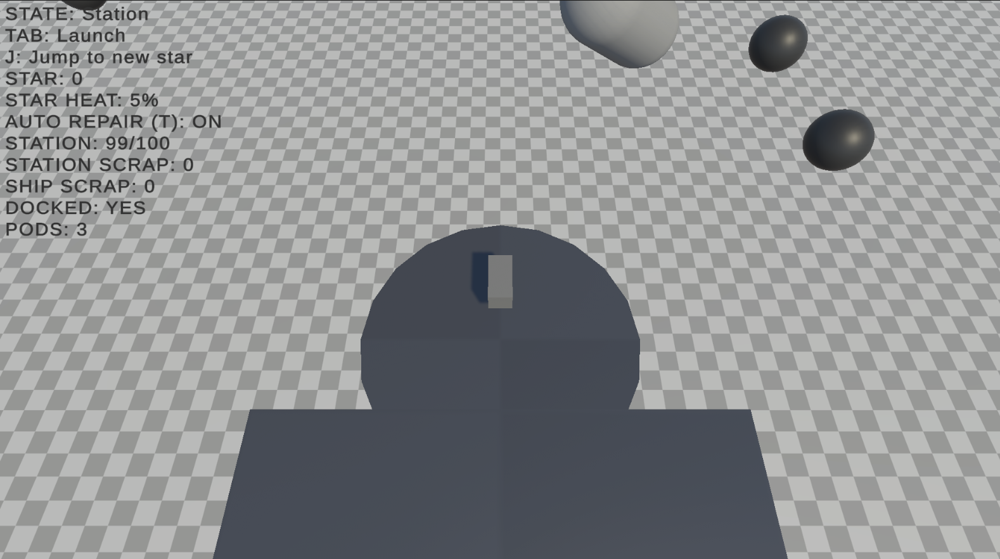
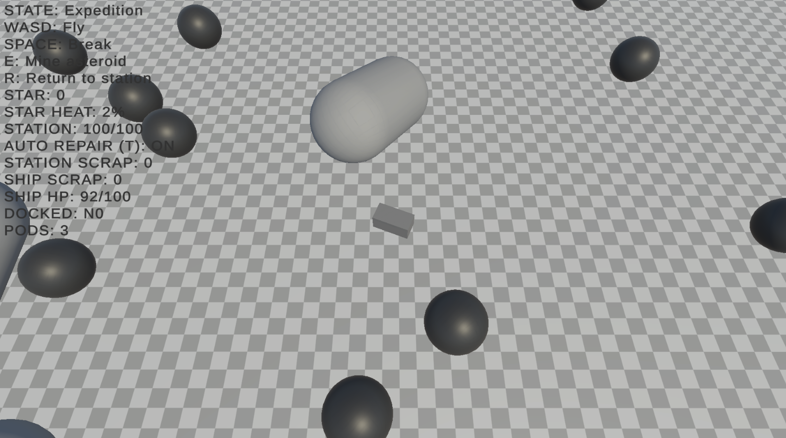
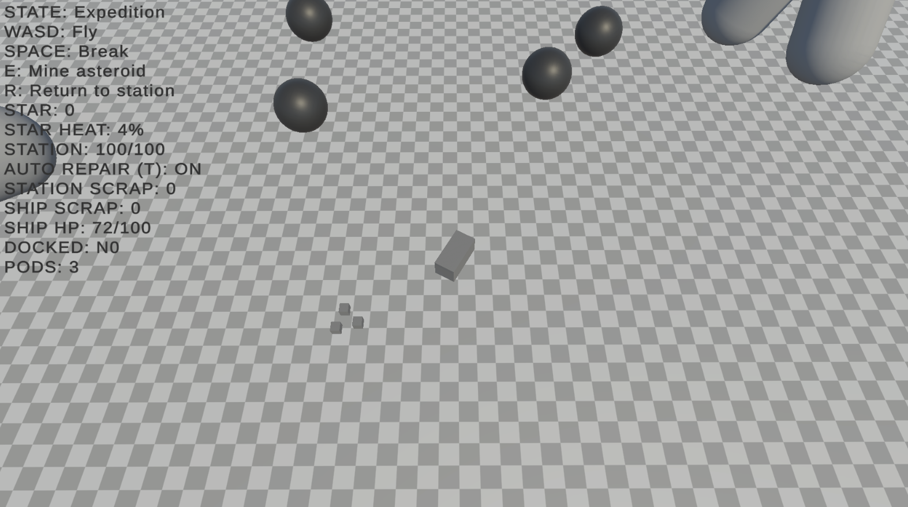

# Falling Star

Roguelike space survival prototype built in Unity.

## 🖼️ Screenshots

## Overview

Falling Star is a systems-focused prototype exploring a survival loop centered around resource management, exploration, and escalating environmental pressure.

The player pilots a ship between a space station and asteroid fields, gathering resources while managing increasing danger over time.

---

## Core Systems

### Game State System

- Station ↔ Expedition state transitions
- Clear separation of gameplay modes and responsibilities
- Persistent world elements across runs

### Resource & Survival Loop

- Collect scrap during expeditions
- Transfer resources back to the station
- Use resources to repair and extend survival

### Dynamic World Systems

- Procedural asteroid spawning (mineable vs hazardous)
- Persistent objects between expeditions
- Risk/reward gameplay decisions

### Pressure Mechanic

- Increasing “star pressure” over time
- Drives difficulty and survival tension
- Tied to station integrity and player decision-making

---

## Tech

- Unity
- C#
- Custom game state management
- Physics-based interactions

---

## Design Focus

This project emphasizes:

- Gameplay systems and architecture
- State-driven design
- Iteration speed and prototyping

It is intentionally not a fully polished game, but a focused exploration of core mechanics and systems.

---

## Future Improvements

- Expanded progression systems
- Additional enemy and hazard types
- UI/UX improvements
- Balancing and difficulty tuning

---

## Notes

This project was developed as a solo prototype to explore system design in a roguelike survival context.

---

## Repo

https://github.com/Pherpher089/Falling-Star
